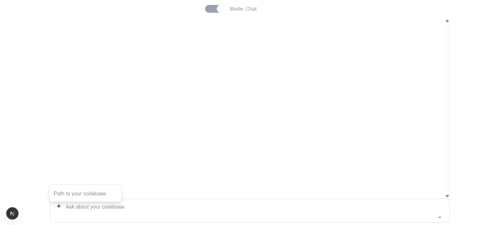
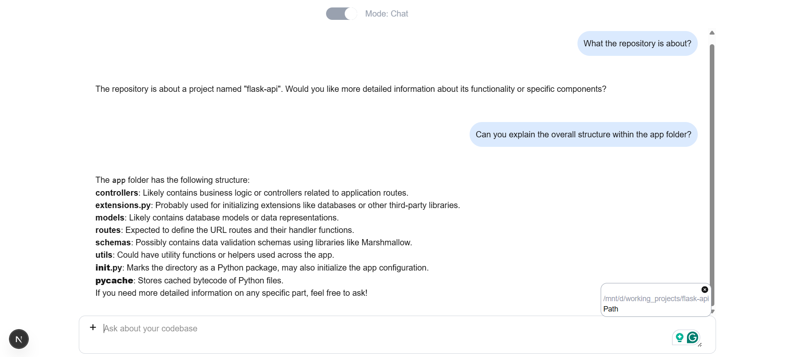
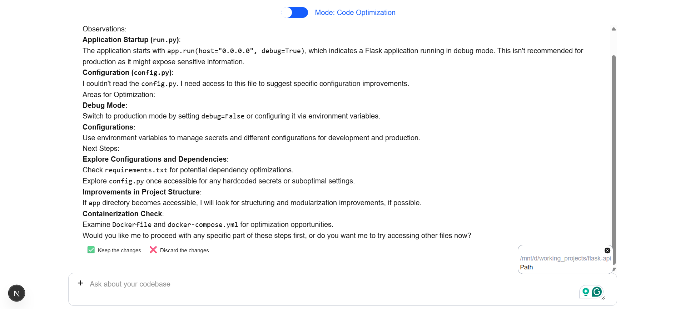
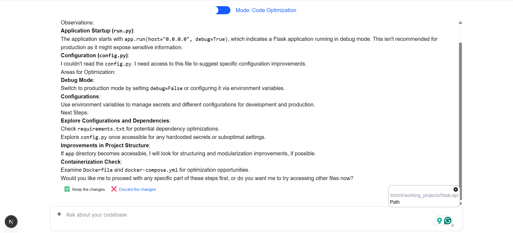

## Installation

```https://github.com/YEEthanCC/codebase-rag-client.git```

## Install Dependencies
**npm**
```
npm install
```
**pnpm**
```
pnpm install
```


## Set Up Enironment Configuation
1. Set up [server](https://github.com/YEEthanCC/codebase-rag-api)
2. Set up environment variable
```
cp .env.example .env
```

## Run
**npm**
```
npm run dev
```
**pnpm**
```
pnpm run dev
```

## How To Use
1. Input the path to your codebase


2. Query the codebase


3. Switch to code optimization


4. Revert changes agent made to codebase



